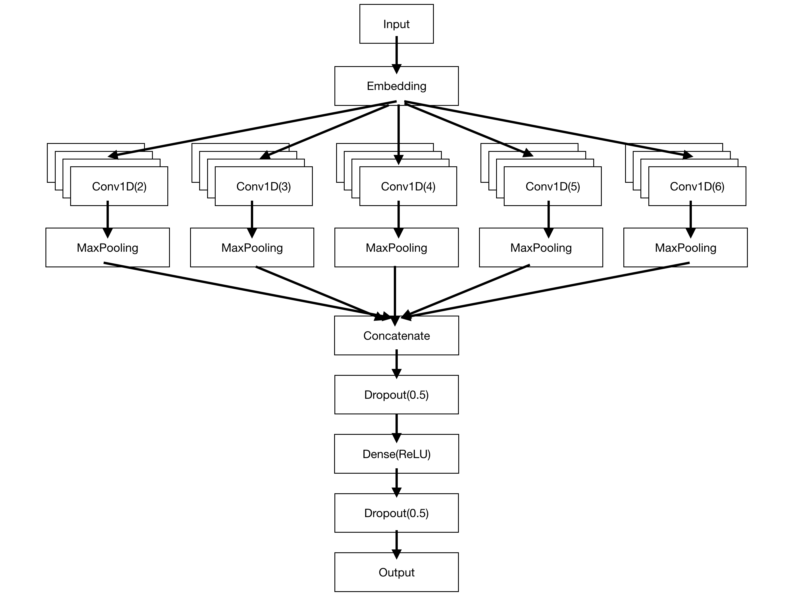

# Convolutional Neural Network (CNN) 

This CNN architecture adapted from [Vosoughi, et. al](https://lsm.media.mit.edu/papers/tweet2vec_vvr.pdf) and based on code from [Yu, et. al](http://faculty.washington.edu/mdecock/papers/byu2018a.pdf).



Using the following initialised variables:

```
max_features = 38
input_shape = MAX_STRING_LENGTH
net = {}
```

Python 3.7

## References
```
@inproceedings{vosoughi2016tweet2vec,
  title={Tweet2vec: Learning tweet embeddings using character-level cnn-lstm encoder-decoder},
  author={Vosoughi, Soroush and Vijayaraghavan, Prashanth and Roy, Deb},
  booktitle={Proceedings of the 39th International ACM SIGIR conference on Research and Development in Information Retrieval},
  pages={1041--1044},
  year={2016},
  organization={ACM}
}
```

```
@inproceedings{yu2018character,
  title={Character level based detection of DGA domain names},
  author={Yu, Bin and Pan, Jie and Hu, Jiaming and Nascimento, Anderson and De Cock, Martine},
  booktitle={2018 International Joint Conference on Neural Networks (IJCNN)},
  pages={1--8},
  year={2018},
  organization={IEEE}
}
```
